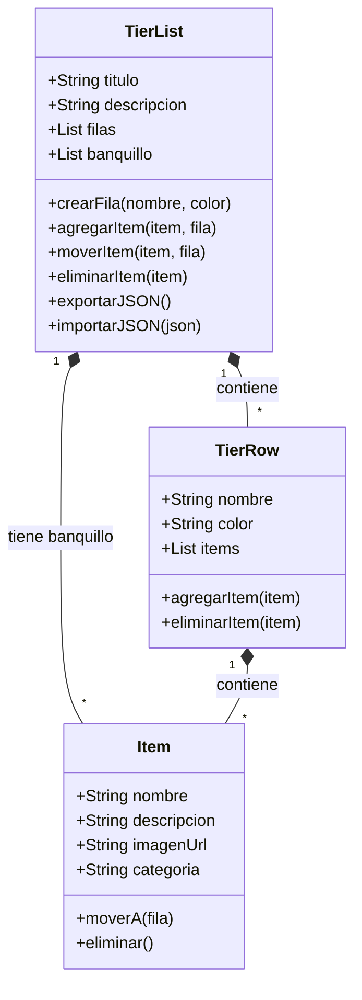

#sample mermaids
```mermaid
useCaseDiagram
  actor Cliente
  Cliente --> (Consultar Saldo)
  Cliente --> (Retirar Efectivo)
```
# tierlists
tierlists to do coevaluation with the alumns

```mermaid
classDiagram
    class TierList {
        +String titulo
        +String descripcion
        +List<TierRow> filas
        +List<Item> banquillo
        +crearFila(nombre, color)
        +agregarItem(item, fila)
        +moverItem(item, fila)
        +eliminarItem(item)
        +exportarJSON()
        +importarJSON(json)
    }

    class TierRow {
        +String nombre
        +String color
        +List<Item> items
        +agregarItem(item)
        +eliminarItem(item)
    }

    class Item {
        +String nombre
        +String descripcion
        +String imagenUrl
        +String categoria
        +moverA(fila)
        +eliminar()
    }

    TierList "1" *-- "*" TierRow : contiene
    TierList "1" *-- "*" Item : tiene banquillo
    TierRow "1" *-- "*" Item : contiene
```
